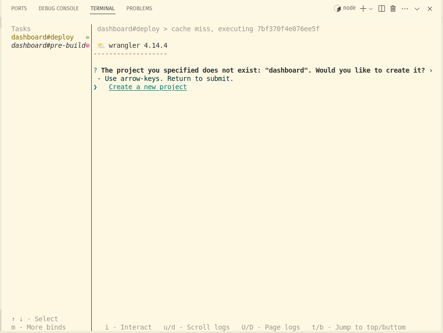
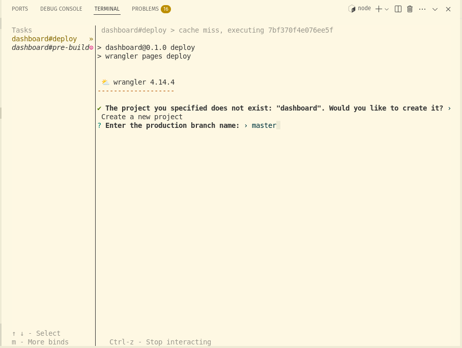
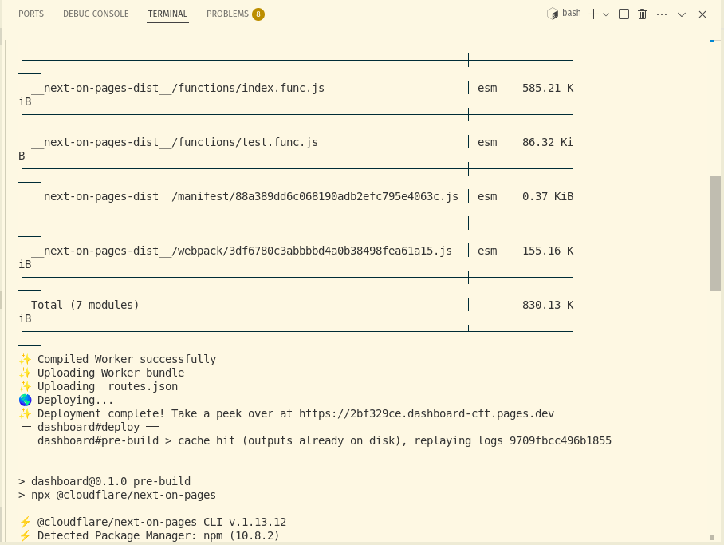
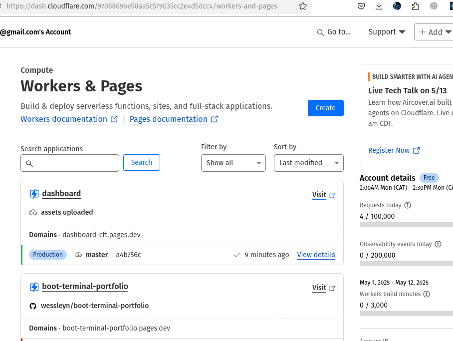

# How to deploy

## Pre-requisites

1. Make sure you have the latest version of Turbo CLI installed globally:

   ```bash
   npm install -g turbo
   ```

2. Ensure you have the latest version of Wrangler CLI installed globally:

   ```bash
    npm install -g wrangler
   ```

3. Make sure you have a Cloudflare account with Workers access.

4. Log in to your Cloudflare account using Wrangler:

   ```bash
   npx wrangler login
   ```

5. Make sure you have git installed and configured on your machine.

   ```bash
   git --version
   ```

6. Make sure you're logged in to your Cloudflare account:

   ```bash
   wrangler whoami
   ```

7. And your git is configured:

   ```bash
   git config --global user.name "Your Name"
   git config --global user.email "your.email@example.com"
   ```

## $ turbo deploy



## $ Select your project name



## $ Thats it



## $ Visit the Dashboard for your public URL and to setup custom domains (optional)


